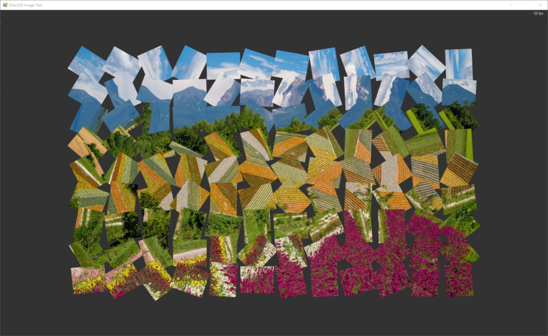
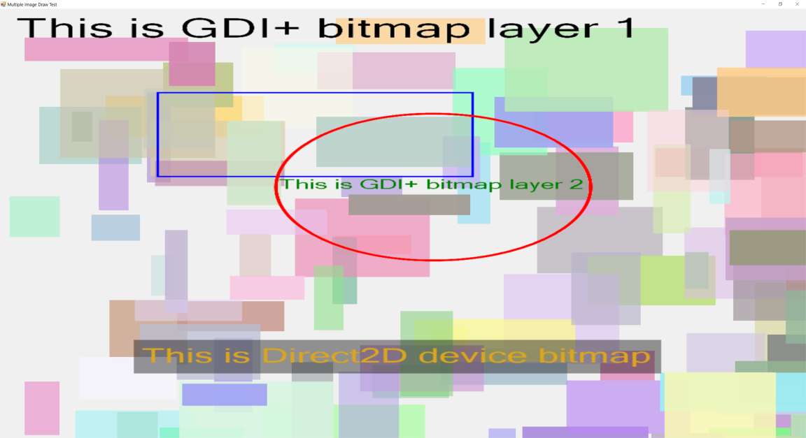
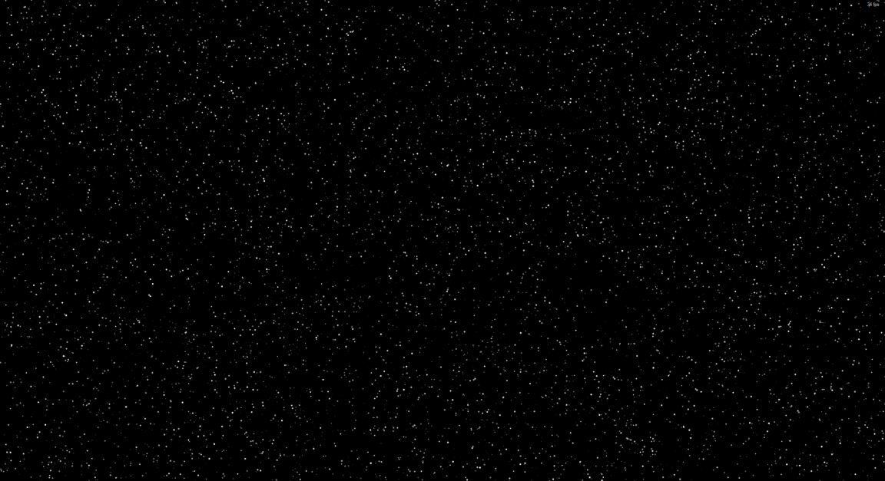
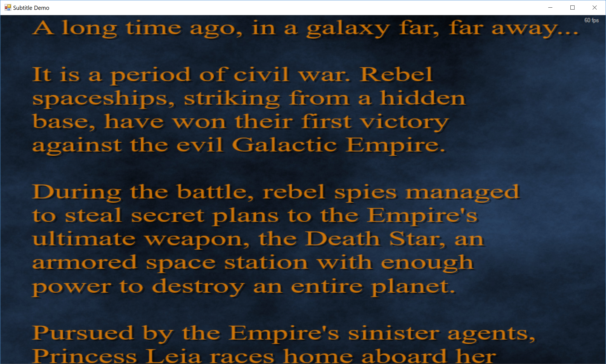

# d2dlib

A .NET library that provides the hardware-accelerated high-performance immediate mode rendering functionality via Direct2D API.

By using the graphics context to draw anything on windows form, control or draw in memory. The interface of the graphics context is designed like the .NET framework Windows Form GDI+ graphics interface, it's easy-to-use and user-friendly.

| Project | Language | Description | Output DLL | 
| --- | --- | --- | --- |
| d2dlib | VC++ | Wrapper host-side library, calling Windows SDK and Direct2D API | d2dlib.dll | 
| d2dlibexport | C# | Wrapper client-side library, export the interface provided from d2dlib | d2dlibexport.dll |
| d2dlibexportwinform | C# | Provides the .NET classes used in windows form development, like D2DWinForm and D2DControl that use Direct2D hardware-acceleration rendering | d2dlibwinform.dll |

# Installation

## Get binary from NuGet

```shell
install-package unvell.d2dlib
```

## Install manually

### Get binary from the source code repository

When you have cloned the source code repository, the binary DLLs can be found at the `binary/x86-build` folder.

### Build from source code

Use git to clone the source code repository

```shell
git clone https://github.com/jingwood/d2dlib
```

Open `d2dlib.sln` from the `src` folder with Visual Studio 2019 or later, choose `Build` -> `Batch Build...` menu, then click `Build` button.

The output DLLs will be generated to the `binary/x86-build` folder.

### Add project references

1. Add `d2dlibexport.dll` and `d2dlibwinform.dll` as application references
2. Put `d2dlib32.dll` in the `Debug`, `Release` or the folder where the application runs

You can also add `d2dlib32.dll` as a project file, and set it's property `Copy to output folder` to `Copy if newer`.

For different build configuration and platform target, the d2dlib32.dll is named as following:

| Build configuration | Platform | Name |
|---|---|---|
| Debug | x86 (32bit) | d2dlib32d.dll |
| Release | x86 (32bit) | d2dlib32.dll |
| Debug | x64 (64bit) | d2dlib64d.dll |
| Release | x64 (64bit) | d2dlib64.dll |

## Installation Notice

## For application uses .NET Core, .NET framework 4.5 and later

Make sure the "Prefer 32-bit" option is checked. You can find this option from the "Build" page of the project setting.

## For application uses .NET framework 4 and early 

Change the project's build configuration from 'Any CPU' to 'x86' architecture.

# Getting Started

1. Make windows form or control inherited from `D2DForm` or `D2DControl` class
2. Override `OnRender(D2DGraphics g)` method (do not override .NET `OnPaint` method)
3. Draw anything inside `OnRender` method via the `g` context

# Basic rendering

## Draw rectangle

```csharp
var rect = new D2DRect(0, 0, 10, 10);
g.DrawEllipse(rect, D2DColor.Red);
```

## Draw an ellipse

```csharp
var ellipse = new D2DEllipse(0, 0, 10, 10);
g.DrawEllipse(ellipse, D2DColor.Gray);
```

## Draw text

```csharp
protected override void OnRender(D2DGraphics g)
{
  g.DrawText("Hello World", D2DColor.Yellow, this.Font, 100, 200);
}
```

## Using brush object

### Solid color brush

```csharp
var brush = Device.CreateSolidColorBrush(new D2DColor(1, 0, 0.5));
g.DrawEllipse(rect, brush);
```

### Linear and radio gradient brush

```csharp
var brush = Device.CreateLinearGradientBrush(new D2DPoint(0, 0), new D2DPoint(200, 100),
  new D2DGradientStop[] {
    new D2DGradientStop(0, D2DColor.White),
    new D2DGradientStop(0.5, D2DColor.Green),
    new D2DGradientStop(1, D2DColor.Black),
  });
```

## Draw bitmap

```csharp
g.DrawBitmap(bmp, this.ClientRectangle);
```

## Convert GDI+ bitmap to Direct2D bitmap for getting high-performance rendering

```csharp
// convert to Direct2D bitmap
var d2dbmp = Device.CreateBitmapFromGDIBitmap(gdiBitmap);

// draw Direct2D bitmap
g.DrawBitmap(d2dbmp, this.ClientRectangle);
```

# Drawing on in-memory bitmap

## Drawing on GDI+ bitmap

```csharp
// create and draw on GDI+ bitmap
var gdiBmp = new Bitmap(1024, 1024);
using (Graphics g = Graphics.FromImage(gdiBmp))
{
  g.DrawString("This is GDI+ bitmap layer", new Font(this.Font.FontFamily, 48), Brushes.Black, 10, 10);
}

// draw memory bitmap on screen
g.DrawBitmap(gdiBmp, this.ClientRectangle);
```

Learn more about [Bitmap](https://github.com/jingwood/d2dlib/wiki/Bitmap).
See [Example code](src/Examples/Demos/BitmapCustomDraw.cs)

## Drawing on Direct2D memory bitmap

```csharp
var bmpGraphics = this.Device.CreateBitmapGraphics(1024, 1024);
bmpGraphics.BeginRender();
bmpGraphics.FillRectangle(170, 790, 670, 80, new D2DColor(0.4f, D2DColor.Black));
bmpGraphics.DrawText("This is Direct2D device bitmap", D2DColor.Goldenrod, this.Font, 180, 800);
bmpGraphics.EndRender();

// draw this device bitmap on screen
g.DrawBitmap(bmpGraphics, this.ClientRectangle);
```

*Note:* When creating a Direct2D Device bitmap, do not forget call `BeginRender` and `EndRender` method.

# Using transform

By calling `PushTransform` and `PopTransform` to make a transform session.

```csharp
g.PushTransform();

// rotate 45 degree
g.RotateTransform(45, centerPoint);

g.DrawBitmap(mybmp, rect);
g.PopTransform();
```

# Examples

Fast images rendering

See [source code](src/Examples/Demos/ImageTest.cs)

Custom draw on memory bitmap

See [source code](src/Examples/Demos/BitmapCustomDraw.cs)

Star space simulation

See [source code](src/Examples/Demos/StarSpace.cs)

Subtitle rendering

See [source code](src/Examples/Demos/Subtitle.cs)

Whiteboard App
\
See [source code](src/Examples/Demos/Whiteboard.cs)
